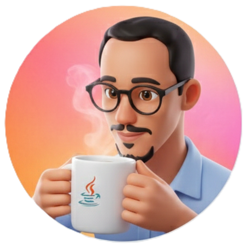

# Olá, eu sou o Antony! 👋 🚀

  
  

  
  

### "Transformo café em código e conhecimento"

Sou um **Desenvolvedor de Software Full Stack** apaixonado por criar soluções escaláveis e experiências digitais de alto impacto. Com mais de 3 anos de estrada, foco no ecossistema **React, Next.js e Node.js**. Atualmente, atuo no desenvolvimento de sistemas críticos para diagnóstico de rede e gestão de hardware na **SoftPlus**.

---

## 🛠️ Tecnologias e Ferramentas

### Front-end

  
  
  
  
  
  
  

### Back-end

  
  
  
  
  

### DevOps & Ferramentas

  
  
  

---

## 📊 Estatísticas do GitHub

  
  

---

## 🎓 Formação & Liderança

* 🎓 Bacharelando em **Engenharia de Computação** pela UEFS (Prev. 2026).
* 📜 Técnico em TI pelo IFBA.
* 🌍 **Inglês Avançado (C1)**.
* 👥 Liderança: Fui Diretor de Ensino no DAECOMP e Representante Discente.

---
*Este perfil foi construído com foco em Clean Architecture e performance.*
